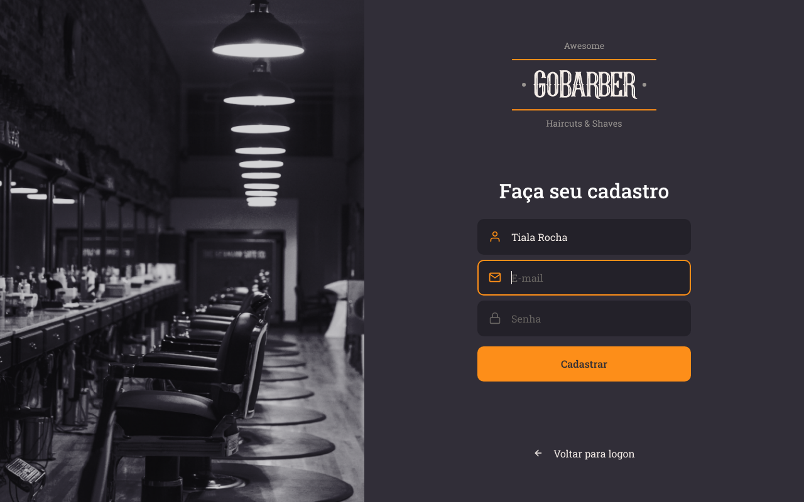
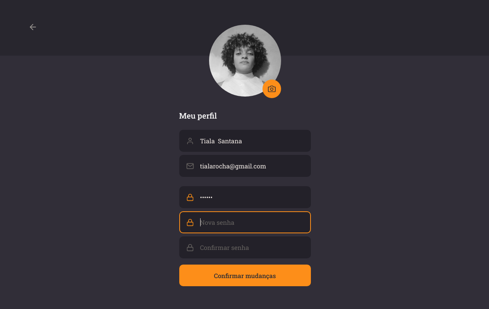
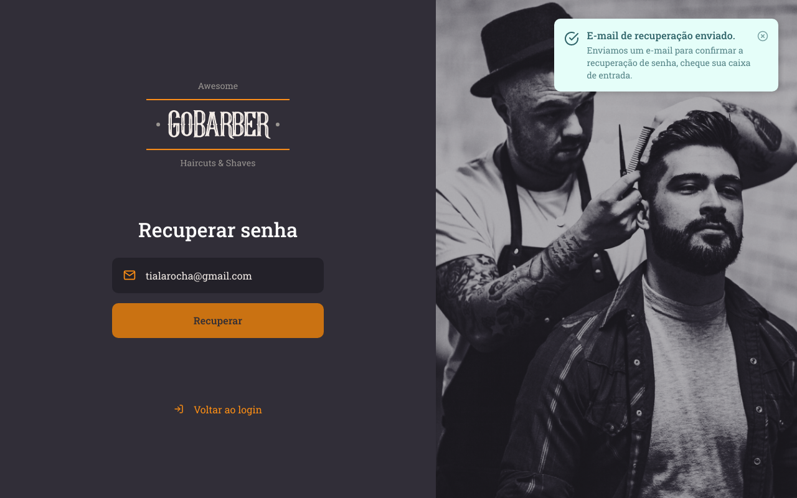

<h1>🚀 GoBarber web</h1>

GoBarber web was the main web application that I developed during my entire career at Rocketseat's Bootcamp using ReactJS with TypeScript.

This application allows service providers (in this case hairdressers from a certain establishment that uses the software) in the scope of authentication to perform the login, registration and password recovery. Within the application it is possible for providers to view the schedules that users of the mobile platform have made for this provider in question. Schedules are illustrated as a list and are displayed according to the month, day and time, that is, for each day of the selected month and year a list will be displayed containing the schedules for the same divided into the morning and afternoon shifts . The provider can also change your registration details and insert an avatar to your profile.

   

