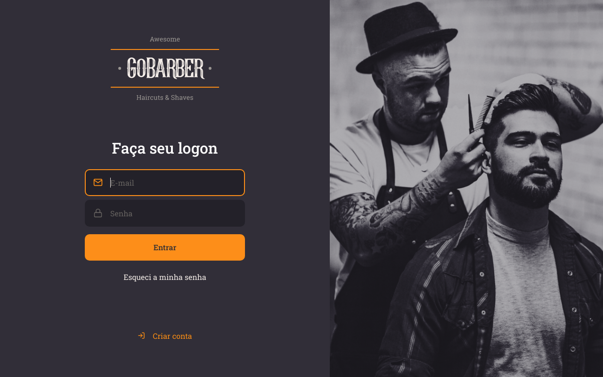

<h1>GoBarber web</h1>

GoBarber web foi a aplicação web principal que desenvolvi durante toda minha tragetória na Bootcamp da Rocketseat utilizando o ReactJS com o TypeScript.

Essa aplicação permite que os prestadores de serviço (nesse caso cabeleleiros de um determinado estabelecimento que utilize o software) em âmbito de autenticação realizem o login, o cadastro e a recuperação de senha. Dentro da aplicação é possível que os prestadores vizualizem os agendamentos que os usuários da plataforma mobile realizaram para com esse prestador em questão. Os agendamentos são ilustrados em forma de lista e são exibidos de acordo com o mês, dia e horário, ou seja, para cada dia do mês e ano selecionado será exibida uma lista contendo os agendamentos para o mesmo dividida nos turnos da manhã e da tarde. O prestador também poderá alterar seus dados cadastrais e inserir um avatar ao seu perfil.

   

